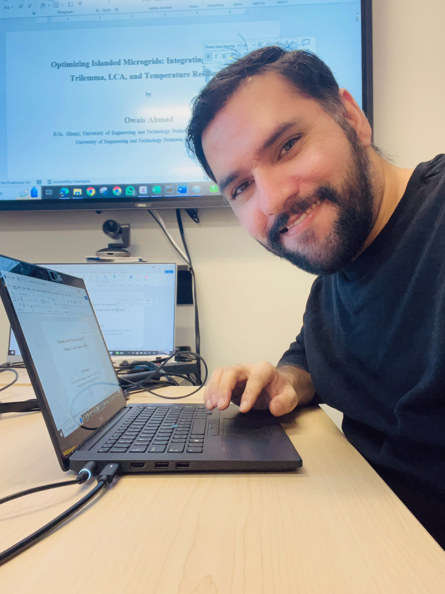

# 👋 Hi, I'm Owais Ahmad (owaistoru)

**PhD Candidate in Mechanical Engineering at the University of Victoria**

I model and optimize renewable-energy microgrids for a more resilient, equitable, and sustainable future—integrating advanced optimization, life cycle assessment, and cutting-edge solar technologies.

---

## 🔬 **Research Focus**
- Microgrid & Renewable Systems Modeling
- Multi-objective Optimization (NSGA-II)
- Life Cycle Assessment Integration
- AI-powered Solar PV Performance Modeling

## 🛠️ **Top Skills**
- Python · MATLAB · AutoCAD
- PGMcpp internals & Pybind11 bindings
- Power systems tools: OpenDSS, HOMER, PVSyst

## 🚀 **Featured Projects**
- **[NSGA-II Microgrid Optimization Toolkit]**  
  Python toolkit for islanded microgrids—security, equity, sustainability, and LCA-ready.

- **[PGMcpp Python Bindings](https://github.com/owaistoru/OwaisPGMcpp)**  
  C++ core classes exposed with Pybind11 for rapid prototyping.

- **Flow Battery + Converter Integration**  
  New storage and converter components for PGMcpp, compiling toward full Python exposure.

- **Solar PV Modeling with AI**  
  Research on PV performance and decentralized power systems using data-driven approaches.

---

## 🌱 **Fun Facts / Hobbies**
- Multilingual: Pashto, Urdu, English
- Strong chai game: chamomile with cardamom
- Heat seeker: always up for spicy food

---

> **Let’s connect to advance resilient, equitable, and sustainable energy systems!**

